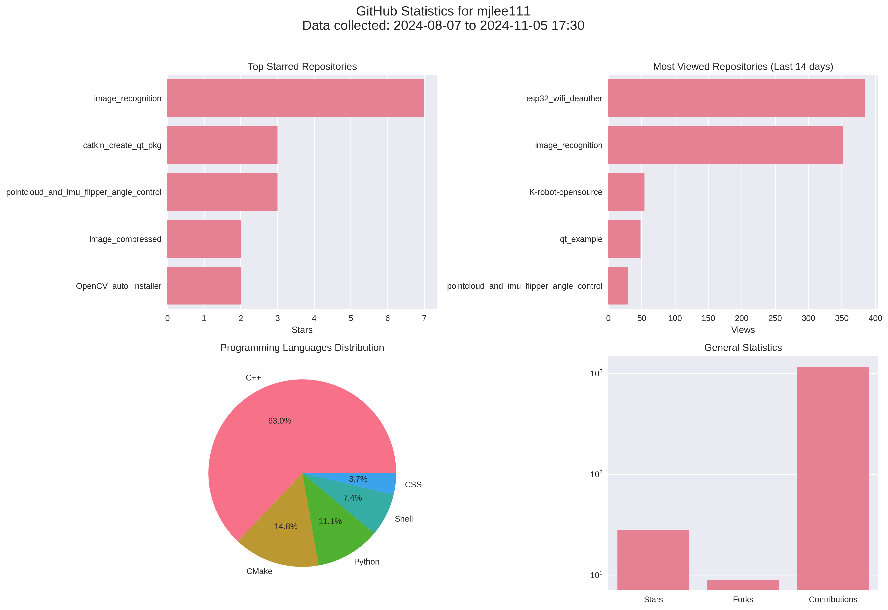

# Github-Status-Py
This is a Python script that analyzes GitHub user statistics and generates visualizations.

<div align="center">

[](https://www.python.org/)
[](LICENSE)
</div>

## Features
- Analyzes GitHub user statistics
- Generates visualizations
- Saves visualizations as PNG files

## Usage
1. Install the required libraries:
```bash
$ pip3 install -r requirements.txt
``` 
2. Run the script:
```bash
$ python3 github_status.py
# Enter your GitHub username and token when prompted.
```
## Results
The script will generate a PNG file named `github_stats_{username}.png` in the current directory, containing the visualizations of the user's GitHub statistics.

1. CLI-results


2. GUI-results


## Contributing
I welcome all contributions! Whether it's bug reports, feature suggestions, or pull requests, your input helps me to improve. If you're interested in contributing, please check out my contributing guidelines or submit an issue.

## License
This project is licensed under the [Apache 2.0 License](LICENSE). Feel free to use and distribute it according to the terms of the license.

## Contact
If you have any questions or feedback, don't hesitate to reach out! You can contact me at [menggu1234@naver.com][email].

[email]: mailto:menggu1234@naver.com